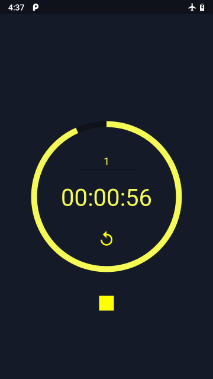

# Timer

## Description

[Timer](https://github.com/farisfebrianto/timer) is an Android Java app that do simple countdown timer for basic mobile programming class task. It basic operation is start/stop timer, reload timer, and set timer in minute. Tested on Android 9.0 Pie.

## Screenshot

